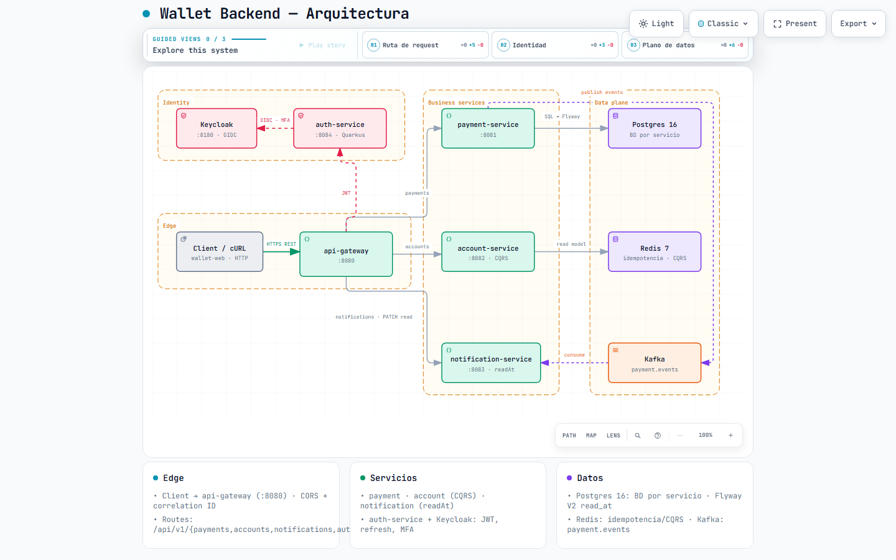
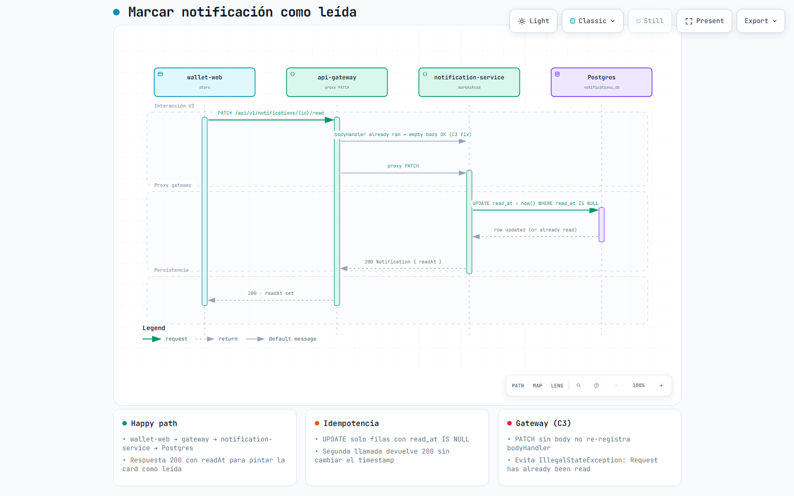

# Wallet Backend

Backend de billetera digital estilo fintech, multi-módulo **Quarkus 3.33** + Kafka
con auth-service + Keycloak.
Maneja dinero, así que el código aplica rigor de servicio crítico: idempotencia,
timeouts explícitos, circuit breakers, correlación end-to-end, errores RFC 9457,
migraciones versionadas, autenticación JWT con refresh tokens y MFA, y
observabilidad RED (Prometheus + Grafana + Tempo).

## Diagramas

| Diagrama | HTML interactivo | Preview |
|----------|------------------|---------|
| Arquitectura del sistema | [wallet-backend-architecture.html](docs/diagrams/wallet-backend-architecture.html) |  |
| Secuencia: marcar notificación leída | [mark-notification-read.html](docs/diagrams/mark-notification-read.html) |  |

Los HTML son standalone (tema claro/oscuro, zoom, guided views, export PNG/SVG).
Las specs viven en `docs/diagrams/*.json` (Archify showcase, 9/9 checks).

```
Client → api-gateway(:8080) → payment(:8081) / account(:8082) / notification(:8083)
                ↓                      ↓              ↓                 ↓
         auth-service(:8084)      payments_db   accounts_db     notifications_db
                ↓                      └──── Kafka payment.events ──┘
            Keycloak(:8180)              Redis 7 (idempotency / CQRS)
```

## Stack tecnológico

| Componente | Versión | Rol |
|------------|---------|-----|
| Java       | 25      | ScopedValues, Stream Gatherers, pattern matching, virtual threads |
| Quarkus    | 3.33.3.2 | Framework base de los 5 servicios (gateway, payment, account, notification, auth) |
| Keycloak   | 25.0    | OIDC provider, JWT, MFA TOTP, refresh tokens |
| Kafka      | KRaft   | Bus de eventos entre servicios (`payment.events`, `account.events`) |
| Postgres   | 16      | Persistencia (un cluster, una BD por servicio) + Flyway |
| Redis      | 7       | Idempotencia, rate-limit, CQRS read model |
| Micrometer + Prometheus | via Quarkus BOM | Métricas RED |
| Grafana + Tempo + Loki | latest | Dashboards, traces (reemplaza Jaeger), logs |
| Lombok     | 1.18.42 | Reducción de boilerplate |
| Maven      | 3.9     | Build multi-módulo |
| Angular    | 22      | Frontend wallet-web (zoneless) |
| Vitest     | 5.0     | Testing frontend |

## Decisiones arquitectónicas

### 1. Idempotencia con Redis (SET NX EX)
Toda operación de mutación acepta `Idempotency-Key`. Si la clave ya está en
Redis (TTL 24h) se devuelve el resultado cacheado sin re-ejecutar.

**Por qué Redis y no SQL**: SET NX es atómico (sin race), TTL es trivial y la
latencia bajo carga es sub-milisegundo. 24h cubre cualquier reintento razonable
del cliente y mantiene la memoria acotada.

**Si el cliente no envía la key**: en `payment-service` se rechaza con
`400 IDEMPOTENCY_KEY_REQUIRED`. En el consumer de Kafka el `eventId` del
metadata actúa como clave implícita.

**Frontend (wallet-web)**: el `IdempotencyInterceptor` solo **preserva** keys
existentes — no genera ni sobreescribe. Cada adapter (`PaymentAdapter`,
`AccountAdapter`) genera `crypto.randomUUID()` y lo setea en el header
`Idempotency-Key`. Esto garantiza que cada operación de mutación tiene su
propia key única sin dependencia del interceptor.

### 2. Autenticación JWT + Refresh Tokens + MFA
Microservicio `auth-service` (Quarkus 3.17) que integra con Keycloak:

- **Refresh tokens**: rotación con family tracking para detectar reuse.
  El refresh token se almacena con `tokenFamily` para detectar si un token
  fue reusado después de un refresh (invalida toda la familia).
- **MFA (TOTP)**: setup, verify y disable vía Keycloak. Recovery codes
  generados con configuración TOTP (HmacSHA1, 6 dígitos, 30s).
- **Token revocation**: revocación de refresh tokens por userId o por
  token específico.
- **Frontend**: `TokenRefreshInterceptor` intercepta respuestas 401,
  refresca el token transparentemente y reintenta el request original.
  `AuthService` expone métodos `refresh()`, `revoke()`, `setupMfa()`,
  `verifyMfa()`, `disableMfa()`.

### 3. CQRS + Event Sourcing (account-service)
El estado de la cuenta NO se guarda como columnas sino como secuencia de
eventos en `event_store` (JSONB + UNIQUE(aggregate_id, version)). El read
model vive en Redis (rápido) con un backup en `account_view` (duradero).

**Por qué separar write/read**: el write side necesita invariantes de negocio
(saldo ≥ 0, versionado optimista), el read side necesita latencia plana. Mezclar
ambos en una sola tabla fuerza a elegir entre consistencia e índice.

**Por qué Redis para el read model**: GET sub-ms vs SQL roundtrip. **Trade-off**:
Redis puede evictar en frío — por eso persistimos también en Postgres como
fuente de reconstrucción.

### 4. Rate limiting + timeout en el gateway
El gateway aplica rate limit por IP (100 req/min, burst 200) y enruta a los
servicios downstream. Cada adaptador aplica su propio timeout/retry de forma
explícita (sin reintentos en operaciones no idempotentes).

### 5. Correlation ID end-to-end
Cada request lleva `X-Correlation-Id`. Si el cliente no lo envía, el gateway
genera un UUID v7. Se propaga vía:
- filtro HTTP → `ScopedValue<UUID>` en el hilo (Java 25) + MDC en logs
- header HTTP saliente a servicios downstream
- header Kafka (`X-Correlation-Id`) en cada mensaje
- campo `correlationId` en `EventMetadata`

### 6. Errores RFC 9457
Cada respuesta de error es `application/problem+json` con campos estables:
`type`, `title`, `status`, `detail`, `instance`, `code`, `correlationId`,
`timestamp`. Los clientes pueden ramificar en `code` sin parsear mensajes.

### 7. Observabilidad
Cada servicio expone métricas Prometheus vía Micrometer (Quarkus
`quarkus-micrometer-registry-prometheus`) con métricas RED por endpoint.
Health checks personalizados para Kafka, Redis y Postgres.
Logs estructurados con patrón que incluye `correlationId`.
OpenTelemetry OTLP → **Grafana Tempo** (Jaeger fue reemplazado); logs → Loki.

### 8. Resiliencia
Timeouts explícitos (Hikari connection-timeout=5s, Kafka delivery=30s).
Retry SOLO en operaciones idempotentes. Fallback en circuit breakers abiertos
(`/fallback/{service}` en el gateway).

### 9. Notificaciones con semántica leído/no leído
`notifications.read_at TIMESTAMPTZ` (migración Flyway **V2**) define
**unread = `read_at IS NULL`** — no el estado de entrega `PENDING/SENT`.
Endpoints idempotentes:

- `PATCH /api/v1/notifications/{id}/read` → `200` con `readAt` (404 si no existe)
- `PATCH /api/v1/notifications/{userId}/read-all` → `200 {"marked":N}`

El frontend (`unreadCount`) cuenta `!readAt`; click en la card o
*Mark all as read* disparan los PATCH vía el gateway (body vacío — el
gateway no re-registra `bodyHandler` en ese path).

Ver: [diagrama de secuencia](docs/diagrams/mark-notification-read.html).

## Estructura del proyecto

```
BackendFintech/
├── pom.xml                                  parent (packaging=pom)
├── docker-compose.yml                       infra + servicios
├── Makefile
├── README.md
├── prometheus.yml
├── otel-collector-config.yml                OTLP → Tempo / Prometheus
├── init-postgres/                           crea las 3 BDs al primer arranque
├── config-repo/                             Spring Cloud Config source (montado file:///config-repo)
├── contracts/                               OpenAPI 3.1 + protobuf (source of truth)
├── docs/diagrams/                           Archify specs + HTML + visual-check
├── monitoring/
│   ├── grafana/{provisioning,dashboards}/
│   └── tempo/tempo.yml
├── scripts/                                 JVM diagnostics (jvm-diagnose, JVM-TUNING-REFERENCE)
├── shared/                                  módulo común (sin Spring/Quarkus)
│   └── src/main/java/com/wallet/shared/
│       ├── api/{ErrorResponse,PageResponse}.java
│       ├── event/{AccountEvent,...,EventMetadata}.java
│       ├── filter/{CorrelationIdFilter,RequestLoggingFilter}.java
│       ├── money/{Money,MoneySerializer}.java
│       ├── util/{IdGenerator,JsonUtil}.java
│       └── kafka/KafkaTopics.java
├── api-gateway-quarkus/                     Quarkus reverse proxy + CORS + rate limit
├── payment-service-quarkus/                 Quarkus + JPA (payments_db)
├── account-service-quarkus/                 Quarkus + Event Sourcing + CQRS
├── notification-service-quarkus/            Quarkus + Kafka consumer + read_at
├── auth-service-quarkus/                    Quarkus + Keycloak (MFA, tokens)
│   └── src/main/java/com/wallet/auth/
│       ├── application/
│       │   ├── port/out/{KeycloakMfaPort,KeycloakTokenPort}.java
│       │   └── service/{TokenRefreshService,TokenRevocationService,
│       │                 MfaSetupService,MfaVerificationService,MfaDisableService}.java
│       ├── domain/
│       │   ├── {RefreshToken,TokenPair,MfaSetup,MfaVerification}.java
│       │   └── exception/{...}.java
│       ├── infrastructure/keycloak/
│       │   └── {KeycloakTokenAdapter,KeycloakMfaAdapter}.java
│       └── interfaces/rest/
│           ├── {AuthResource,MfaResource}.java
│           └── dto/{...}.java
└── apps/wallet-web/                         Angular 22 frontend (zoneless)
    └── src/app/
        ├── core/
        │   ├── infrastructure/auth.service.ts
        │   ├── interceptors/
        │   │   ├── token-refresh.interceptor.ts    ← JWT refresh transparente
        │   │   ├── idempotency.interceptor.ts      ← preserva keys existentes
        │   │   ├── correlation-id.interceptor.ts
        │   │   ├── error.interceptor.ts
        │   │   └── request-id.interceptor.ts
        │   └── guards/auth.guard.ts
        └── features/
            ├── accounts/
            │   ├── application/stores/account.store.ts    ← idempotencia
            │   └── infrastructure/account.adapter.ts      ← genera Idempotency-Key
            ├── payments/
            │   ├── application/stores/payment.store.ts
            │   └── infrastructure/payment.adapter.ts      ← genera Idempotency-Key
            └── notifications/                             ← read/unread (readAt)
                ├── domain/notification.model.ts
                ├── application/stores/notification.store.ts   ← unreadCount = !readAt
                ├── infrastructure/notification.adapter.ts      ← PATCH read / read-all
                └── ui/pages/notification-list/
```

## Cómo arrancarlo

### Prerrequisitos
- Java 25 (`java -version` debe decir 25) — `JAVA_HOME` debe apuntar a JDK 25
- Maven 3.9+
- Docker + Docker Compose (para la infraestructura)
- Node.js 22+ (para wallet-web)
- pnpm (gestor de paquetes del frontend)

### 1) Compilar todo
```bash
# Backend (sin wrapper mvnw — usa Maven del sistema)
export JAVA_HOME=/path/to/jdk-25
mvn -s ~/.m2/settings.local.xml clean package -DskipTests

# Frontend
cd apps/wallet-web && pnpm install && cd ../..
```

### 2) Levantar la infraestructura
```bash
make up
# o
docker compose up -d --build
```

Esto levanta Postgres, Redis, Kafka (KRaft, sin Zookeeper), Keycloak,
Tempo, Loki, Prometheus, Grafana y los 5 microservicios Quarkus.
La primera vez tarda ~5-8 minutos (descarga imágenes, compila módulos).

### 3) Verificar
- API Gateway: http://localhost:8080/q/health
- Auth Service: http://localhost:8084/q/health
- Keycloak: http://localhost:8180 (admin / admin)
- Prometheus: http://localhost:9090
- Grafana: http://localhost:3000 (admin / change-me) — traces en Explore → Tempo

## Cómo probarlo

### Autenticación

#### Obtener token de acceso
```bash
curl -X POST http://localhost:8180/realms/wallet/protocol/openid-connect/token \
  -H "Content-Type: application/x-www-form-urlencoded" \
  -d "grant_type=password&client_id=wallet-backend&username=<user>&password=<pass>"
```

#### Refrescar token
```bash
curl -X POST http://localhost:8084/api/v1/auth/refresh \
  -H "Content-Type: application/json" \
  -d '{"refreshToken":"<refresh_token>"}'
```

#### Revocar token
```bash
curl -X POST http://localhost:8084/api/v1/auth/revoke \
  -H "Content-Type: application/json" \
  -d '{"refreshToken":"<refresh_token>"}'
```

#### MFA — Setup TOTP
```bash
curl -X POST http://localhost:8084/api/v1/mfa/setup \
  -H "Authorization: Bearer <access_token>"
```

#### MFA — Verificar código
```bash
curl -X POST http://localhost:8084/api/v1/mfa/verify \
  -H "Authorization: Bearer <access_token>" \
  -H "Content-Type: application/json" \
  -d '{"code":"123456"}'
```

#### MFA — Deshabilitar
```bash
curl -X POST http://localhost:8084/api/v1/mfa/disable \
  -H "Authorization: Bearer <access_token>"
```

### Abrir una cuenta
```bash
curl -X POST http://localhost:8080/api/v1/accounts \
  -H "Content-Type: application/json" \
  -H "X-Correlation-Id: demo-001" \
  -d '{"userId":"user-1","initialBalance":"100.00 USD"}'
```

### Depositar
```bash
curl -X POST http://localhost:8080/api/v1/accounts/<ACCOUNT_ID>/deposits \
  -H "Content-Type: application/json" \
  -d '{"amount":"50.00","currency":"USD"}'
```

### Crear un pago (requiere `Idempotency-Key`)
```bash
curl -X POST http://localhost:8080/api/v1/payments \
  -H "Content-Type: application/json" \
  -H "Idempotency-Key: pay-abc-001" \
  -H "X-Correlation-Id: demo-002" \
  -d '{"userId":"user-1","amount":"25.00 USD"}'
```

### Ver notificaciones del usuario
```bash
curl http://localhost:8080/api/v1/notifications/user-1?page=0&size=20
```

### Marcar una notificación como leída (idempotente)
```bash
curl -X PATCH http://localhost:8080/api/v1/notifications/<NOTIFICATION_ID>/read
# → 200 {"id":"...","readAt":"2026-09-22T..."}  (segunda llamada: 200, mismo readAt)
# → 404 si el id no existe
```

### Marcar todas como leídas
```bash
curl -X PATCH http://localhost:8080/api/v1/notifications/user-1/read-all
# → 200 {"marked":3}
```

**Semántica**: *unread* = `read_at IS NULL` (no el estado de entrega
`PENDING/SENT`). El índice parcial `idx_notifications_user_unread` acelera
el listado de no leídas.

## Tópicos Kafka

| Topic              | Productor           | Consumidores                              | Headers                                     |
|--------------------|---------------------|-------------------------------------------|---------------------------------------------|
| `payment.events`   | payment-service     | account-service, notification-service     | `X-Correlation-Id`, `event-type`, `event-id`|
| `account.events`   | account-service     | (reservado para futuros consumidores)     | igual                                       |

**Consumer groups** (cada uno recibe TODOS los eventos):
- `account-service`
- `notification-service`

## Esquema de base de datos

### `payments_db` (payment-service)
- `payments(id, user_id, amount NUMERIC(19,4), currency CHAR(3), status, idempotency_key UNIQUE, created_at, updated_at, version)`
- Índices: `idx_payments_user_id`, `idx_payments_created_at DESC`

### `accounts_db` (account-service)
- `event_store(id, aggregate_id, aggregate_type, event_type, event_data JSONB, version, created_at, correlation_id, UNIQUE(aggregate_id, version))`
- `account_view(account_id, user_id, balance_amount, balance_currency, status, version, last_updated)` — backup del read model

### `notifications_db` (notification-service)
- `notifications(id, user_id, type, subject, body, status, processed_event_id UNIQUE, created_at, sent_at, read_at TIMESTAMPTZ)`
- Índice parcial: `idx_notifications_user_unread ON (user_id) WHERE read_at IS NULL`
- Migraciones Flyway en `notification-service-quarkus/src/main/resources/db/migration/` (`V1` esquema base, `V2` agrega `read_at`)

Las tres BDs se crean automáticamente al primer arranque vía `init-postgres/`;
el schema de cada servicio lo aplica **Flyway** al arrancar el contenedor.

### Keycloak (auth-service)
- Realm `wallet` importado vía `keycloak/import/wallet-realm.json`
- Client `wallet-backend` con refresh tokens habilitados
- MFA TOTP configurado (HmacSHA1, 6 dígitos, 30s, window=1)

## Errores y códigos

Todos los errores son `application/problem+json`. Códigos estables:

| HTTP | code                       | Significado                                          |
|------|----------------------------|------------------------------------------------------|
| 400  | `BAD_REQUEST`              | Cuerpo o parámetros malformados                      |
| 400  | `IDEMPOTENCY_KEY_REQUIRED` | Falta el header `Idempotency-Key`                     |
| 401  | `UNAUTHORIZED`             | Token JWT inválido o expirado                         |
| 401  | `INVALID_REFRESH_TOKEN`    | Refresh token invocado o no existe                    |
| 401  | `TOKEN_REVOKED`            | Refresh token fue revocado                            |
| 404  | `NOT_FOUND`                | Ruta no encontrada                                   |
| 404  | `PAYMENT_NOT_FOUND`        | Pago inexistente                                     |
| 404  | `ACCOUNT_NOT_FOUND`        | Cuenta inexistente                                   |
| 409  | `DUPLICATE_PAYMENT`        | Idempotency-Key ya usado                             |
| 409  | `CONCURRENT_MODIFICATION`  | Conflicto de versión en event store                  |
| 409  | `MFA_ALREADY_ENABLED`      | MFA ya está habilitado para este usuario             |
| 422  | `VALIDATION_FAILED`        | Bean Validation falló                                |
| 422  | `INSUFFICIENT_FUNDS`       | Saldo insuficiente para withdrawal                   |
| 422  | `INVALID_MFA_CODE`         | Código TOTP inválido o expirado                      |
| 422  | `MFA_NOT_ENABLED`          | MFA no está habilitado para este usuario             |
| 429  | `TOO_MANY_REQUESTS`        | Rate limit por IP excedido                           |
| 503  | `CIRCUIT_OPEN`             | Circuit breaker abierto en el gateway                |
| 5xx  | `INTERNAL_ERROR`           | Error inesperado (ver logs con correlationId)        |

## Deuda técnica consciente

- **Outbox pattern**: el publicador de Kafka se ejecuta tras el commit JPA
  (`TransactionSynchronizationManager.registerSynchronization`). Funciona,
  pero deja una ventana donde DB committed y Kafka falló. Migrar a outbox
  transaccional cuando se necesite.
- **Snapshots**: el event store se reconstruye por replay completo. Para
  cuentas con miles de eventos, agregar snapshots periódicos.
- **Rate limiting más granular**: actualmente 100 req/min por IP global.
  Produciría querer buckets por endpoint o por usuario autenticado.
- **Pago → Cuenta automático**: el consumer de `account-service` recibe
  `PaymentCompletedEvent` pero la lógica de "qué cuenta acreditar" está
  simplificada. En producción: payment-service debería enviar el
  `accountId` explícito en el evento, o el consumer debería auto-crear
  cuenta para el `userId` la primera vez.
- **Tests backend**: suite multi-módulo con Surefire/Failsafe (unitarios +
  `*IT` integration tests con Testcontainers). Ejecutar con
  `mvn verify`. Fallback/notification service: 13 tests verificados en la
  feature de read/unread; frontend 240 tests.
- **Tests frontend**: suite Vitest con patrón `Injector.create()` +
  `runInInjectionContext()` para adapters, `new Store(mock)` para stores —
  sin TestBed.

## Próximos pasos para producción

1. ~~**Spring Security + JWT**~~ ✅ Implementado vía auth-service + Keycloak.
2. **Outbox transaccional** con Debezium o equivalente.
3. **Snapshots de agregado** cada N eventos.
4. **Tracing distribuido**: auth-service y el resto de servicios ya exportan
   OTLP → collector → **Grafana Tempo** (Jaeger retirado).
5. **Schema Registry** para los payloads Kafka.
6. **Rate limit por usuario** (no solo IP) — usar `userId` del JWT.
7. **Tests de carga** (Gatling / k6).
8. **CI/CD** con GitHub Actions, escaneo de imágenes, política de admisión.
9. **Multi-tenancy**: cada `userId` pertenece a un tenant.
10. **Backups PITR** para Postgres.

## Comandos útiles (Makefile)

```bash
make build         # mvn clean package -DskipTests
make up            # docker compose up -d
make down          # docker compose down
make logs          # docker compose logs -f
make ps            # docker compose ps
make clean         # mvn clean + docker compose down -v
make test-payments # curl POST /api/v1/payments with idempotency key
make kafka-topics  # listar tópicos de Kafka
```

## Notas de implementación

### Backend
- Java 25: se usan `record`, `sealed interface AccountEvent`, pattern
  matching exhaustivo en `Account.apply()`, y `ScopedValue` para correlación
  end-to-end (con try-catch porque `ScopedValue.orElse(null)` es ilegal en JDK 25).
- **Quarkus 3.33** en los 5 servicios (BOM `io.quarkus.platform:quarkus-bom`):
  JAX-RS + RESTEasy Reactive, Smallrye Health (`/q/health`), Micrometer →
  Prometheus, OTLP → collector. Sin Spring MVC/actuator.
- UUID v7 vía `com.fasterxml.uuid:java-uuid-generator`. Se prefiere v7 sobre
  v4 por orden temporal (mejor para primary keys y orden de eventos).
- `Money` siempre `BigDecimal`. Nunca `float`/`double`.
- Lombok: se usan `@Getter`, `@Setter`, `@ToString`, `@RequiredArgsConstructor`,
  nunca `@Data` (explícito > mágico).
- Auth service: Clean Architecture con puertos y adaptadores.
  `KeycloakTokenAdapter` y `KeycloakMfaAdapter` implementan los puertos de
  salida contra la API Admin de Keycloak. Refresh tokens con family tracking
  para detectar reuse.
- Gateway: `GatewayRouteRegistrar` hace proxy de body; para requests sin body
  (GET, PATCH `/read`, DELETE) **no** re-registra `bodyHandler` — evita
  `IllegalStateException: Request has already been read` tras el BodyHandler
  de orden -1.
- notification-service: `CorsFilter` incluye `PATCH` en
  `Access-Control-Allow-Methods`; migración **V2** agrega `read_at` + índice
  parcial de no leídas.

### Frontend (wallet-web)
- Angular 22 con `provideZonelessChangeDetection()` (zoneless).
- Testing con Vitest 5 + `vite-tsconfig-paths` (reemplazó `vitest-tsconfig-paths`
  que causaba conflicto de versiones de vite).
- Sin TestBed: adapters usan `Injector.create()` + `runInInjectionContext()`,
  stores se instancian directamente con `new Store(mockService)`.
- `@angular/compiler` importado al inicio de cada spec para soporte de
  compilación inline en vitest.
- Idempotency interceptor: solo preserva `Idempotency-Key` existente — nunca
  genera ni sobreescribe. La generación es responsabilidad de cada adapter.
- Token refresh interceptor: intercepta 401, llama a `AuthService.refresh()`,
  y reintenta el request original con el nuevo token.
